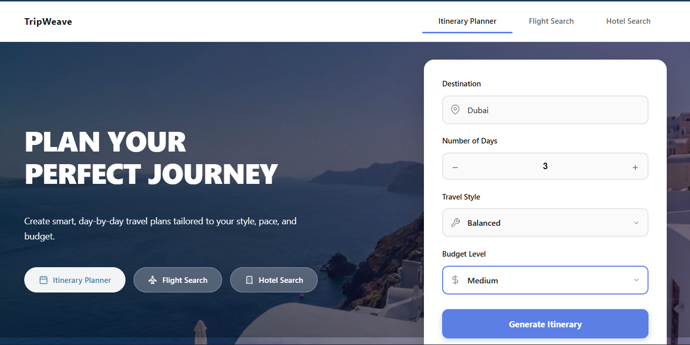
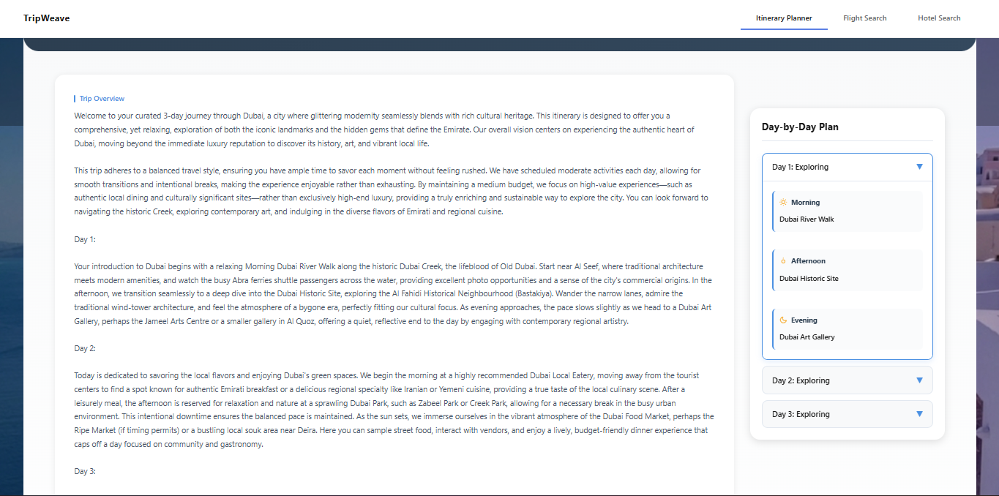
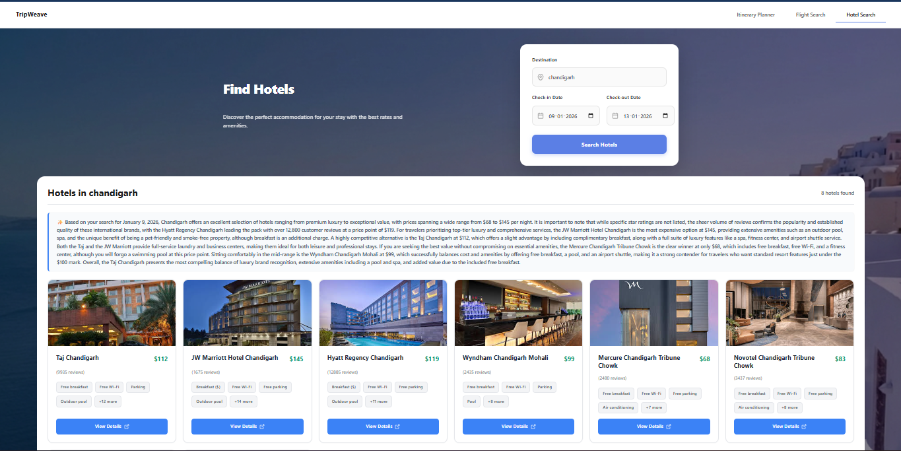
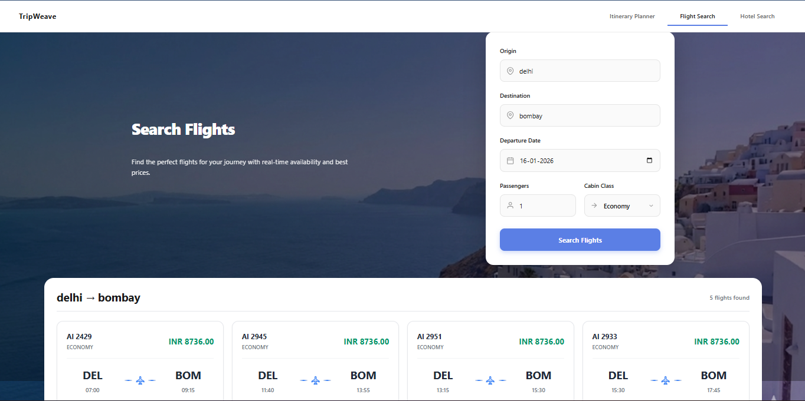

# TripWeave

**Plan smarter. Travel better.**

TripWeave is an **agentic AI-powered travel planning platform** that helps users discover real-time flights, hotels, and generate intelligent travel itineraries.
It combines **reliable real-world APIs** with **LLM-driven reasoning**, orchestrated through an agent-based architecture.

This project is built with a strong focus on **correct system design** - using LLMs where reasoning is needed, and APIs where factual accuracy matters.

---
## 📸 Screenshots

<p align="center">
  
  
</p>

<p align="center">
  
  
</p>

---

## Key Features

### Real-Time Flight Search

* Powered by **Amadeus Flights API**
* Accurate airline data, pricing, baggage, and timings
* No LLM hallucinations for factual data

### Hotel Discovery

* Powered by **Google Hotels via SERP API**
* Real hotel prices, ratings, images, and reviews
* Graceful handling of missing pricing data

### AI-Powered Itinerary Planning

* LLM-generated multi-day itineraries
* Natural language explanations and recommendations
* Toggleable LLM narration layer

### Agentic Architecture

* Built using **LangGraph**
* Coordinator agent routes user intent
* Specialized agents for flights, hotels, and itinerary planning

### Modern Frontend

* Clean, responsive React UI
* Separate sections for Flights, Hotels, and Itineraries
* Designed for clarity, not clutter

---

## Architecture Overview

```
Frontend (React)
   ↓
FastAPI Backend
   ↓
Coordinator Agent (LangGraph)
   ├── FlightAgent → Amadeus API
   ├── HotelAgent → SERP API (Google Hotels)
   └── ItineraryAgent → LLM (Gemini)
```

**Design principle:**

* APIs for factual data (flights, hotels)
* LLMs only for reasoning and narration

---

## Tech Stack

### Frontend

* React + Vite
* Modern CSS / Tailwind-style layout
* Responsive design

### Backend

* FastAPI
* Python
* LangGraph (agent orchestration)

### APIs & Services

* Amadeus Flights API
* SERP API (Google Hotels)
* Gemini LLM (itinerary generation only)

---

## Getting Started

### Clone the repository

```bash
git clone https://github.com/<your-username>/tripweave.git
cd tripweave
```

### Backend setup

```bash
cd backend
python -m venv venv
source venv/bin/activate   # Windows: venv\Scripts\activate
pip install -r requirements.txt
```

Create a `.env` file:

```env
AMADEUS_API_KEY=your_key
AMADEUS_API_SECRET=your_secret
SERP_API_KEY=your_serp_api_key
GEMINI_API_KEY=your_key
```

Run backend:

```bash
uvicorn main:app --reload
```

---

### Frontend setup

```bash
cd frontend
npm install
npm run dev
```

---

## How It Works (Example Flow)

1. User enters:
   **“Find flights from Delhi to Dubai on 25 Dec”**
2. CoordinatorAgent detects intent → `flight`
3. FlightAgent fetches real data from Amadeus
4. Results are formatted and displayed as cards

Same flow applies for hotels and itinerary planning.

---

## Key Design Decisions

* LLMs are **not** used for prices or availability
* APIs are used for all factual travel data
* LLMs are only used where reasoning and explanation are needed
* Graceful fallbacks handle unreliable sandbox APIs
* Modular agents allow easy extension

---


